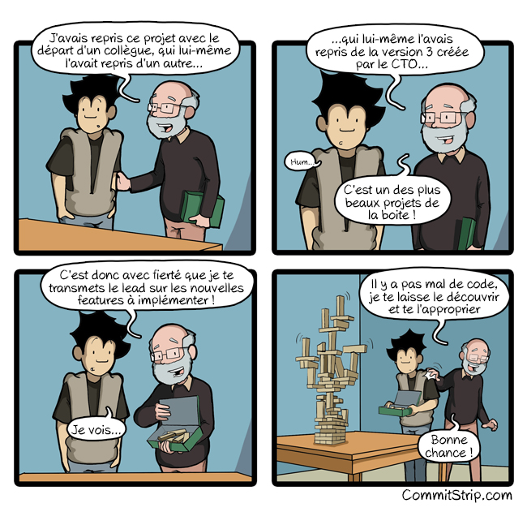
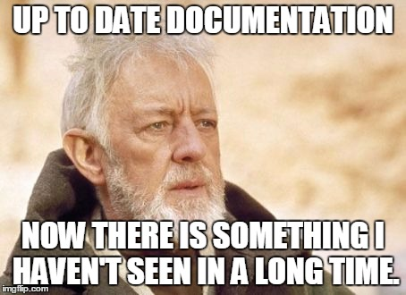
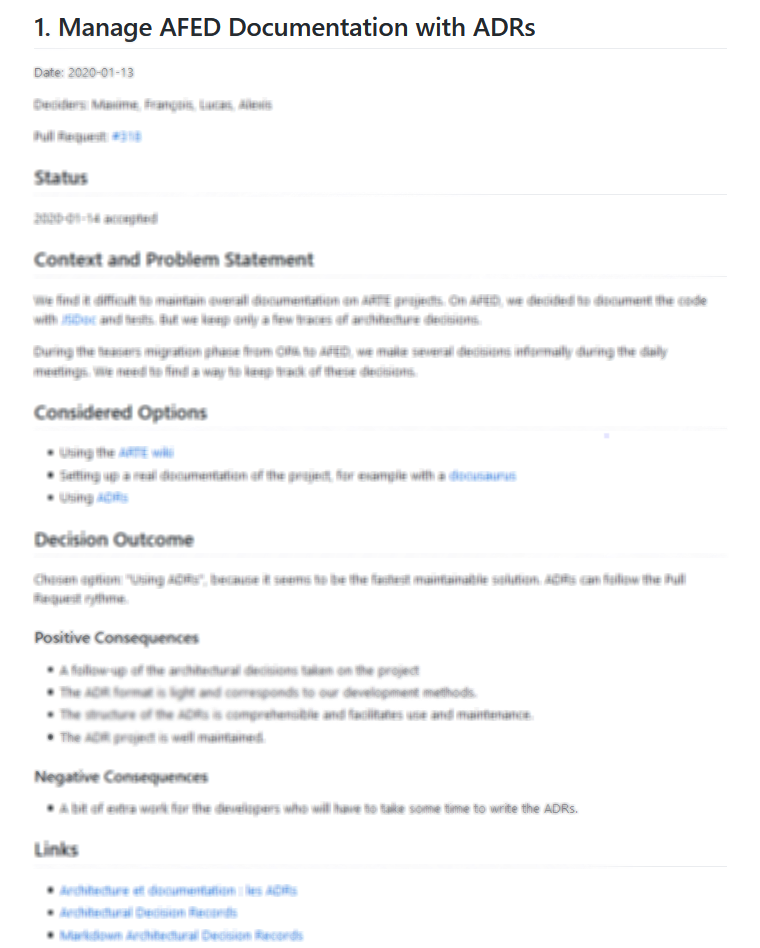
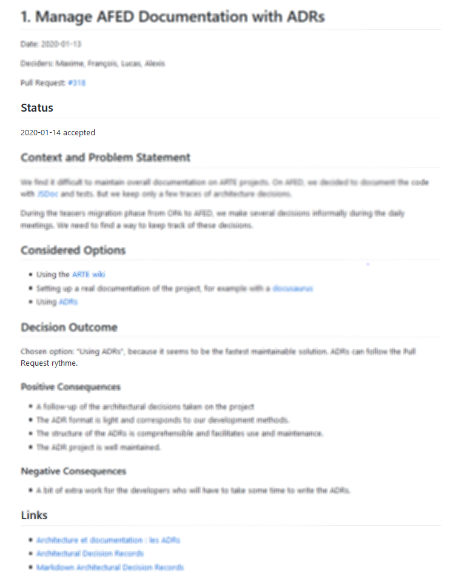

## Communiquer et documenter les décisions d'architecture

---

### _Pourquoi a-t-on mis ça en place déjà?_

#### _Euh… ben… je ne sais plus trop, c’est historique?!_

---

## Nous prenons constamment des décisions

---

## On fait un excellent travail

---

## Mais on n'est pas bon à:

    
    <ul>
        <li>Socialiser/partager les décisions</li>
        <li>Enregistrer les décisions</li>
        <li>Et surtout on perd le contexte</li>
    </ul>

---

## Pas assez documenté

---

### ou mal organisé dans un wiki.

---

## Selon moi une bonne documentation, c'est:

<ul>
    <li>Une information facile à trouver</li>
    <li>Apporte de la valeur, utile</li>
    <li>Facile à maintenir</li>
    <li>Directement dans le code source</li>
</ul>

---

### Architectural Decision Records (ADR)

    
        "An architecture decision record is a short text file in a format to an
        Alexiandran pattern that describes a set to forces and a
        single decision in a response to those forces."
    
    - Proposé part Michael Nygard

---

## C'est quoi un ADR ?

<ul>
    <li>Légé basé sur du texte</li>
    <li>Enregistré avec le projet</li>
    <li>Une décision par fichier (0001-git-for-version-control.md)</li>
</ul>

---

## Que contient ce fichier ?

---

---

---

---

---

---

---

## Le processus de validation

---

## Les outils

https://adr.github.io/

---

## Conseils

<ul>
    <li>Court et précis, pas plus d'une ou deux pages</li>
    <li>Chaque ADR doit concerner une seule décision</li>
    <li>Immutable</li>
    <li>lancez vous, créez-en un</li>
</ul>

---

## Les avantages

    <ul style="margin-right: 50px;">
        <li>Facile à review</li>
        <li>Unboarding</li>
        <li>Empêche les erreurs du passé</li>
        <li>Le partage</li>
        <li>Grande légitimité</li>
    </ul>
    <ul>
        <li>Autonome</li>
        <li>S'améliorer</li>
        <li>Proposition sans concensus</li>
        <li>Pense bête</li>
        <li>S'entrainer</li>
    </ul>

---

## ADRs = Goodness!

---

## Les ADR sont super mais pas nouveau

-   En 1997, dans architecture in practice
-   En 2011, avec documenting architecture decisions

---

## Pourquoi ça devient populaire maitenant?

---

## Quand est-ce que je commence ?

---

## Maintenant

-   Crée un template
-   Crée ton premier ADR
-   Demande à quelqu'un de la review

---

## Avertissement

-   Comprendre les principes
-   Communication > Document

---

### Arte

    

        <h4>Aime</h4>
        <ul>
            <li>Utile ou trés utile</li>
            <li>Unboarding</li>
            <li>Lecture rapide</li>
        </ul>
    

    

        <h4>Principal reproche</h4>
        <ul>
            <li>Créer de bonne habitutes</li>
            <li>Architecture design vs Detailed design</li>
        </ul>
    

    

        <h4>Aime le plus</h4>
        <ul>
            <li>L'historique du projet</li>
            <li>Amélioration</li>
        </ul>
    

---

## Merci!

Slides: https://github.com/zyhou/talks
