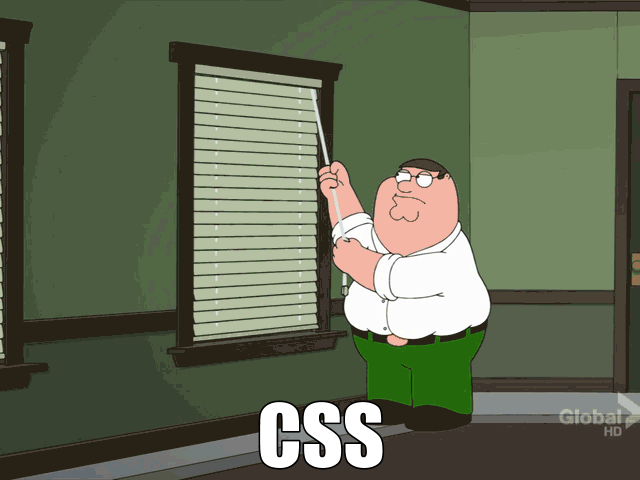
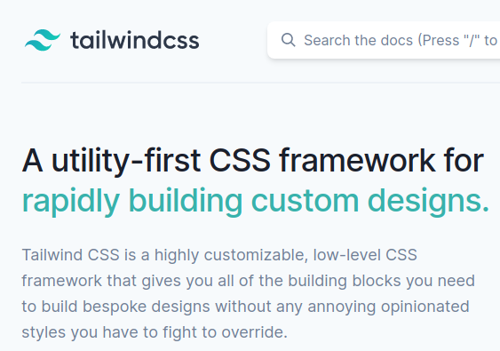
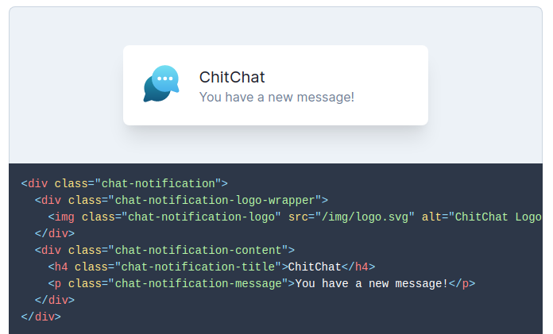
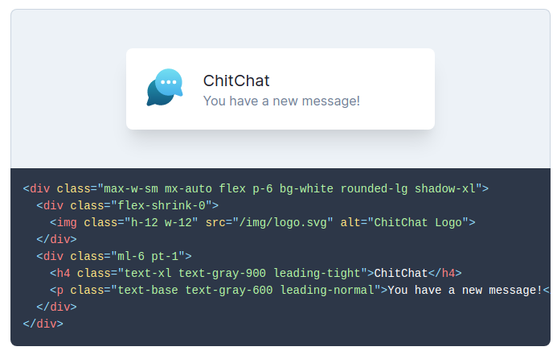
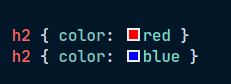
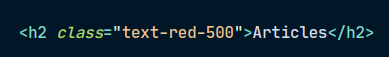
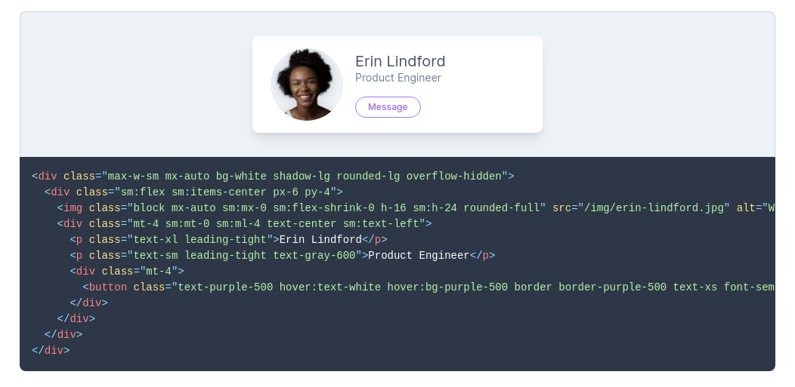

## Pourquoi j'aime à nouveau le CSS ?

---

## Moi, lorsque j'écrivais du CSS !



---

## Les raisons pour lesquelles tu vas aimer l'Utility First CSS

(ou en tous cas ne pas le détester)



---

## CSS traditionel



---

## Utility First CSS



---

## "C'est une atrocité, quel horrible code !"

---

## Fini les problèmes de nommage

"chat-notification-content-button-action"


---

## Fini le cascade hell

<div style="display: flex;">
    <div>
       
    </div>
    <div>
       
    </div>
</div>

---

## "Est-ce que ce ne sont pas juste des styles inline ?"

---

## Responsive Design

## et Pseudo classes



---

## Pas de surcharge de fichiers

```
- bulma.css
- general.css
- blog.css
- tidbit.css
- pagination.css
- banner.css
- footer.css
- header.css
```

---

## Répèter le CSS

```html
<!-- Using utilities -->
<button class="bg-blue-500 hover:bg-blue-700 text-white font-bold py-2 px-4 rounded">
    Button
</button>
```

```html
<!-- Extracting classes using @apply -->
<button class="btn btn-blue">
    Button
</button>
<style>
    .btn {
        @apply font-bold py-2 px-4 rounded;
    }
    .btn-blue {
        @apply bg-blue-500 text-white;
    }
    .btn-blue:hover {
        @apply bg-blue-700;
    }
</style>
```

---

## Autres avantages

-   Rapidité
-   Maintenance
-   Customisation

---

## Merci!

Slides: https://github.com/zyhou/talks

Ressources:

-   [The Case for Atomic / Utility-First CSS](https://johnpolacek.github.io/the-case-for-atomic-css/)
-   [CSS Utility Classes and "Separation of Concerns"](https://adamwathan.me/css-utility-classes-and-separation-of-concerns/)
-   [The State of CSS 2019: CSS Frameworks](https://2019.stateofcss.com/technologies/css-frameworks/)
